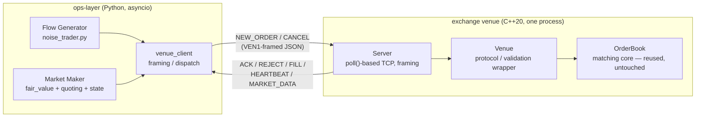

# Trading Operations Autopilot

A live exchange venue and a Python market maker trade against each other
continuously over an explicit wire protocol — two independent processes,
socket-connected, with no shared memory or in-process calls between them.
An independent flow generator provides real counterparty order flow, so
every fill, inventory change, and quote skew below happened through the
live venue, not a mock.

The matching core is reused from an existing order book implementation;
the wire protocol, the venue wrapper, the Python client, the
market-making strategy, and the flow generator are new. It's also the seed
of a larger trading-operations project — see [Next](#next).

## Architecture



The market maker and the flow generator are independent processes that never
talk to each other directly — they only interact through the venue, the same
way two unrelated participants would on a real exchange.

**Current milestone:** the venue and market maker above are fully built and
independently verified — 89/89 C++ unit tests, 42/42 Python unit tests, and
two live multi-process acceptance runs (7/7 criteria each) covering a
30-second sample and the project's literal 300-second soak. Detail in
[Verification](#verification).

## What currently works

### Exchange venue — `engine/order-matching-engine/venue/`

- Standalone TCP process (`venue_server`), single-threaded `poll()` event
  loop over all connections, no locks.
- Wire framing — `[4-byte magic "VEN1"][4-byte big-endian length][JSON
  payload]` — implemented once in C++ (`framing.h`/`.cpp`) and mirrored
  exactly in Python (`venue_client/client.py`).
- Full message set: `NEW_ORDER`, `CANCEL` inbound; `ACK`, `REJECT`,
  `CANCEL_ACK`, `CANCEL_REJECT`, `FILL`, `HEARTBEAT`, `MARKET_DATA` outbound.
- A thin `Venue` wrapper owns protocol-level state the matching core doesn't
  provide — client-order-id ↔ exchange-order-id mapping, field validation,
  reject-on-self-cross, FILL routing — and touches the matching core only
  through its public API (`addLimitOrder`, `cancelOrder`, `bestBid`/`bestAsk`,
  a trade callback).
- HEARTBEAT and MARKET_DATA broadcast on a fixed cadence, plus MARKET_DATA
  pushed immediately whenever the top of book changes.
- The matching core itself (`order_book.h`, `order_pool.h`, `price_level.h`)
  is reused unmodified from the original engine — the venue layer is a
  zero-diff wrapper over it.

### Market maker — `ops-layer/market_maker/`

- Maintains its own fair value: a private Gaussian random walk, deliberately
  independent of the venue's own `MARKET_DATA` — see
  [Engineering decisions](#engineering-decisions).
- Computes an inventory-skewed reservation price and quotes a fixed spread
  symmetrically around it.
- Requotes every tick: cancels both resting orders unconditionally,
  recomputes from the latest fair value and current inventory, submits a
  fresh bid + ask.
- Tracks inventory, cash, and mark-to-market PnL from live `FILL` messages.
  `FILL` carries no side field, so the market maker tracks which side each
  `client_order_id` was submitted on and applies it on receipt.
- Incoming-message dispatch (`HEARTBEAT`/`MARKET_DATA`/`FILL`/`REJECT`) and
  the requote tick loop run as two independently-scheduled coroutines under
  one asyncio event loop — a `FILL` can update state at any point between
  ticks, not just when the next tick happens to run.

### Flow generator — `ops-layer/flow_generator/noise_trader.py`

A market maker resting a bid and ask against an otherwise empty book never
gets filled — nothing crosses its own quotes. The flow generator is a
separate process that fires a marketable order against the market maker's
current best bid/ask on a random interval. It has no fair-value model and
no strategy — its only job is to guarantee real fills happen, so inventory
movement, quote skew, and PnL are all exercised through the live venue
rather than asserted directly against in-memory state.

## End-to-end lifecycle

1. `venue_server` starts and begins its `poll()` loop; the market maker and
   the flow generator connect to it independently.
2. The market maker computes a reservation price from its private fair value
   and zero starting inventory, and submits a bid and an ask.
3. The flow generator fires a marketable order against the market maker's
   resting quote; the venue's `OrderBook` matches it and emits `FILL` to
   both sides.
4. The market maker's fill handler updates `PositionState` — cash and
   inventory move in the direction implied by the fill's side.
5. On the next tick, fair value and the reservation price are recomputed
   from the now-nonzero inventory — the quote skews away from flat — the
   old pair is cancelled, a fresh bid/ask is submitted, and mark-to-market
   PnL is recomputed and logged.
6. Steps 3–5 repeat for the life of the run.

## Quickstart

Prerequisites: a C++20 compiler + CMake, Python 3.10+. No third-party Python
packages are required to run the venue, market maker, flow generator, or
either acceptance harness — all standard library (`asyncio`, `socket`,
`json`). `pytest` is only needed for the fast unit-test suite.

Build the engine + venue once:

```
cd "engine/order-matching-engine"
cmake -B build && cmake --build build
cd ../..
```

Then, from the repo root, run the one-command Phase 2 demo — it starts the
venue, the market maker, and the flow generator as real subprocesses, lets
them run for ~30 seconds, checks the full acceptance checklist against what
actually happened, and tears everything down:

```
python3 ops-layer/tools/phase2_acceptance_test.py
```

A `7/7 criteria passed` line at the end means the whole path — venue up,
market maker quoting, flow generator crossing it, fills landing, inventory
and cash moving, skew in the correct direction, PnL logged every tick, no
crash — happened for real in that run. Pass `--duration 300` for the
project's literal 5-minute soak instead of the default 30-second sample.

To watch it live instead of via the harness, run each process in its own
terminal from the repo root:

```
./engine/order-matching-engine/build/venue_server --port 9200
python3 -m market_maker.main --port 9200          # from ops-layer/
python3 -m flow_generator.noise_trader --port 9200 # from ops-layer/
```

## Representative output

Market maker, mid-run — fair value ticking, a fill landing, and the next
quote skewing in response:

```
[market_maker] tick fv=100.0039 inv=0.0 cash=0.00 pnl=0.00 bid=99.98 ask=100.02
[market_maker] tick fv=99.9905 inv=0.0 cash=0.00 pnl=0.00 bid=99.97 ask=100.01
[market_maker] FILL mm-40343-5 BUY 3@99.98 inv=3.0 cash=-299.94
[market_maker] tick fv=100.0288 inv=3.0 cash=-299.94 pnl=0.15 bid=99.98 ask=100.02
[market_maker] FILL mm-40343-12 SELL 3@100.01 inv=1.0 cash=-99.87
```

Flow generator crossing the resting quotes from the same run:

```
[noise_trader] nt-40357-1 SELL 3@99.98
[noise_trader] nt-40357-3 BUY 3@100.01
```

Phase 2 acceptance harness, tail of a run:

```
[PASS] 4. reservation price skewed the right direction
        inventory=-5.0 fair_value=100.0137 reservation_price=100.0637
[PASS] 6. PnL computed and logged every tick
        30/30 tick lines contain pnl=
7/7 criteria passed
```

## Verification

**Fast tests** — 89/89 C++ unit tests and 42/42 Python unit tests, both
under 10 seconds, for iterating on the code:

```
cd engine/order-matching-engine/build && ctest --output-on-failure
cd ops-layer && pytest
```

**Live acceptance** — two harnesses that start the real processes, not
mocks, and check what actually happened:

```
python3 ops-layer/tools/acceptance_test.py                        # venue only — 7/7 passing
python3 ops-layer/tools/phase2_acceptance_test.py                 # venue + market maker + flow generator, ~30s — 7/7 passing
python3 ops-layer/tools/phase2_acceptance_test.py --duration 300  # same, over a 5-minute soak — 7/7 passing
```

The Phase 2 harness checks that the market maker connected and quoted, the
flow generator produced real fills, fills moved inventory and cash, the
reservation price skewed in the correct direction, quotes refreshed at ~1s
cadence, PnL was logged every tick, and neither process crashed. The
300-second soak logs 300 ticks and carries inventory further from zero
(28.0 units net in the run behind this README), with the skew sign holding
correct for the full run.

## Engineering decisions

**Private fair value.** The market maker doesn't derive fair value from the
venue's own `MARKET_DATA`. With only the market maker and the flow generator
trading, the book is mostly the market maker's own resting quotes — deriving
fair value from it would be circular, so it runs an independent process
(a Gaussian random walk) instead.

**A separate flow generator.** Nothing in the venue creates counterparty
flow on its own. Without an independent participant crossing the market
maker's quotes, inventory, PnL, and skew would only ever be exercised by
synthetically mutating state in a test, not by the live system actually
doing the thing. The flow generator exists purely to make real fills happen.

**Inventory skew.** `reservation_price = fair_value - k × inventory`
(k = 0.01). Long inventory (positive) pulls the reservation price — and
therefore both the bid and the ask — down, making the market maker keener
to sell and less keen to buy, biasing it back toward flat. Short inventory
does the reverse.

**Cancel-and-requote, not conditional updates.** Every tick cancels both
resting orders and submits a fresh pair unconditionally, rather than only
requoting when the new quote differs meaningfully from the old one. Simpler
to reason about and to test; the tradeoff is order churn a production
market maker would care about optimizing away.

**Async architecture.** Incoming message dispatch and the periodic requote
loop are two independently-scheduled coroutines sharing one event loop, not
one polling or blocking on the other — a `FILL` can update state at any
point between ticks instead of only being picked up at the next tick.

**Explicit phase boundaries.** Reconnection handling, risk limits, an
inbound liveness timeout (heartbeat today is server → client only), state
reconciliation, fault injection, and escalation are scoped to later phases —
deliberately, so there's real failure surface for the operations layer to
detect and recover from, rather than a system already hardened against it.

## Repository structure

```
engine/order-matching-engine/
├── include/, src/    reused matching core (OrderBook, OrderPool, PriceLevel) — untouched
├── venue/            new protocol layer: wire framing, message encode/decode, Venue wrapper, poll()-based Server
└── tests/            C++ unit tests, incl. venue_protocol_test (framing/protocol/venue behavior)

ops-layer/
├── venue_client/      Python asyncio client: framing, dispatch, shared protocol helpers
├── market_maker/      fair_value.py, quoting.py, state.py, main.py — the quoting strategy and its bookkeeping
├── flow_generator/    noise_trader.py — independent marketable order flow
├── tools/             acceptance_test.py (Phase 1) and phase2_acceptance_test.py (Phase 2) — live end-to-end harnesses
└── tests/             pytest unit/component suite
```

## Next

The next phase adds an operations layer on top of this venue: fault
injection (killing the connection, delaying a response, dropping a
message), health checks and state reconciliation, a deterministic playbook
executor for recovering automatically, and an escalation policy that hands
off to a real Slack ping when a fault is outside its authority to resolve
alone. The phase boundaries named above
(no reconnection, no risk limits, no inbound liveness timeout) exist so
there's real failure surface for that layer to work against.
